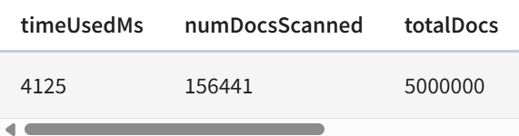

one or two paragraphs

build an index for better performance

largest performance hit is in REGEX vulnerability - text search index (Full Text Search index)
https://docs.pinot.apache.org/basics/indexing/text-search-support#enable-a-per-column-text-index

# EX 10 - Jonas Gstoettenmayr

## Questions

**What are we missing when we execute the queries?**

The data records

**How this last query relates to the Spark Structured Streaming logs processing example from Exercise 3?**

In the last Ex we used spark (push query) to look for records with vulnerability and High severity.
i.e. we executed a similar query but with a stream processor instead of on the OLAP (pull query) like here

**From the material presented in the previous lecture on  Analytical Processing and Apache Pinot's features (available at https://docs.pinot.apache.org/ ), analyze and explain how the performance of the advanced query could be improved without demanding additional computing resources. Then, implement and demonstrate such an approach in Apache Pinot.**

We can massivly improve the query with a Text index, which requires also modifing the query as seen in the new one below.
The index requires some more storage space as it is also stores on the disk but the speed increase is massive!

The old table: it took a whoping 4 seconds for the query to execute!


This is due to the text search for vulnerabilty, it is a regex and as such needs to scan the entire text of EVERY entry to match it!
Which is very slow (simply removing it makes the query take 271 milli seconds)

Using the Text index and query below (like in the EX lession): only 23 milliseconds a 173x speed up of the query, nearly unrecognizable!


```SQL
SELECT source_ip, COUNT(*) AS match_count FROM ingest_kafka_fts
WHERE
  TEXT_MATCH(content, 'vulnerability') AND severity = 'High'
GROUP BY source_ip
ORDER BY match_count DESC
```

Using the same query as above and adding an addition inverted index for severity, so it can filter for severity before the textmatch better only very slightly improves the query time to 21 milliseconds.
But the amount of documents scaned remains the same, as such the improvement actually most likly does not help and the speed up is just pure chance.


**Foundational Exercise: Considering the material presented in the lecture  NoSQL - Data Processing & Advanced Topics and Apache Pinot's concepts https://docs.pinot.apache.org/basics/concepts and architecture https://docs.pinot.apache.org/basics/concepts/architecture, how an OLAP system such as Apache Pinot relates to NoSQL and realizes Sharding, Replication, and Distributed SQL?**

Pinot uses column-oriented storage as well as sharding on scale to scale linearly.\
It achieves this through its architecture which in CAP terms is AP with eventual consistency.

While it uses SQL to query the data its underlying structure is inatly NoSQL. Like its tables which while resembling normal Tables are actually partitioned into smaller segments (configurable how many) allowing different Brokers (servers/nodes) to both store and calculate queries on different partitions.

Pinot allows you to configure how ofen each segment is replicated accros different brokers.

For handling the queries it optimizes them before "shattering" the query and splitting it up among the relevant brokers.

It is able to relise these concepts through apache helix and apache zookeeper to achieve this.

When looking at this architecture it resembles Kafka quite closly with a table being split up much like a topic and its partitions with replication on brokers.
