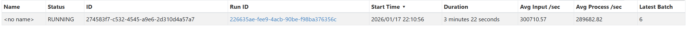
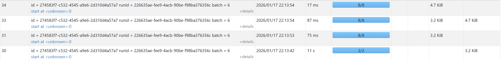
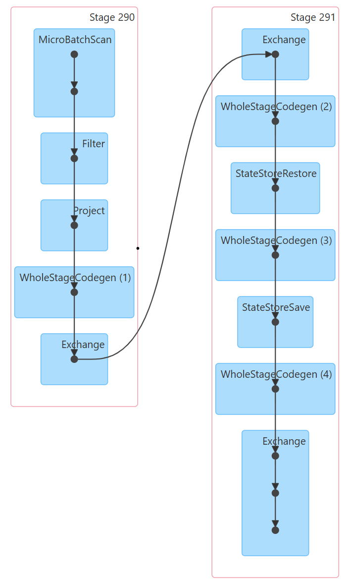

# Exercise 3 - Jonas Gstöttenmayr

Code and and file can also be read on [github](https://github.com/jonas-gstoettenmayr/SDB3_2/tree/main/Exercise3)

## Activity 1

### Practical Exploration Questions

**While your application is running, try to answer these questions:**

**The Bottleneck: Which Stage has the longest "Duration"? What are the technical reasons for it?**
The stage with 200 task at ~8-9s. (i.e. the aggregation steps)
The bottleneck is that we have far to few resources for the standard split of spark (200) partitions, especially with the default config.
We try to split the work up to 200 cores but only have 1 availible leadinig to a massive organisational overhead for no performance gain.
The computaiton time takes by far the longest, but the schedular delay can also not be disregardedd.

**Resource Usage: In the Executors tab, how much memory is currently being used versus the total capacity?**
After roughly a minute of the generator running It was only using 6 MiB out of 848 MiB so a measly amount, where 50% was used by the driver and the other have by the worker.
But it continued climbing steadily

**Explain with your own words the main concepts related to performance and scalability in the scenario of Spark Structured Streaming.**

There are many performance factores

1. The configuration (does it fit the hardware)
2. The network speed (does distribution make sense)
3. The amount of workers
4. The "power" of the workers (both CPU and RAM)

Spark splits execution into 3 parts, how and where they are executed matters.
As they are related it also limits scalability a bit.

1. Jobs (unit of work that brings result)
2. Stage (chunk of job (filtering, grouping....)
3. Task (run by one executor)

A big perfromance impoact will be that tasks run on different executors and thus require much network trafik to merge in the stage.
So a balance must be struck between splitting up computation between machines and limiting network traffik.

Another perfromance factor are the micro-batches if they are to large the program takes to long to finish calculations for our needs, if they are to small it can't keep up with the data flow.

## Activit 2 Tuning for high throughput

I added more more CPU and RAM to the spark instance, both in docker and in the command.
I also reduced sparks 200 tasks down to 8 (the amount of CPU cores the spark worker has to work with), this was the biggest performance improvement.
The last optimization I did was set a minimum processing time through waiting in the query, while counterintuitive at first this extra time means spark will choose larger batches which process quicker.

The new command:

`spark-submit   --master spark://spark-master:7077   --packages org.apache.spark:spark-sql-kafka-0-10_2.13:4.0.0   --num-executors 1   --executor-cores 8   --executor-memory 4G   /opt/spark-apps/spark_structured_streaming_logs_processing.py`

The throughput:



Time per batch (the filtering takes by far the longest):



**Identify "Shuffle" Boundaries: Look for the exchange points where data is redistributed across the cluster.**
The data is redistributed (Exchange) after filtering, and after grouping (WholeStgeCodegen).


**Identify Data Skew: Is data being distributed evenly across all your cores, or are a few tasks doing all the work? Use the DAG to pinpoint which specific transformation is causing a bottleneck.**

The execution itself takes the most amount of time, some of it is spent on the deserilisation of the json and the schedualing (so adding more cores can improve performance still).
But it usilises pretty much all cores equaly


## Activity 3

### Must Also support

***Scalability:** The architecture must support horizontal scaling, allowing the logic to be distributed across a cluster of multiple machines.*

->
Spark does this by "default", especially combined with Kafka, to scale all we need to to is increase the amount of machines that we use for spark and Kafka to run on (and of course allocate those resources to them.)

***Fault Tolerance:** The system must support recovery in the event of infrastructure failure of the worker nodes.*

->
Here we save a checkpoint, which saves Kafka offsets, aggregation states and other metadata.
So if a node were to fail spark would automatically reschedules the failed task on a healthy node and read from that checkpoint.

Through this checkpoint saving Kafka checkpoints we can ensure that no data loss or duplication happens. (only read was was not already read in, unless the reading itself crashed)

What the current implimentation is still lacking is Kafka partitioning for Kafka data safty and adding into the configuration a maxretry count so don't get stuck in an endless loop of trying to fufill and impossible tas

### Technical Discussion

*Explain how your specific implementation satisfies the requirements, including a discussion on your solution could handle the scenario of late-arriving records that can appear after a 10-second interval has concluded.*

The querie in the code satisfies the requirements of getting the data in the correct format and grouping, the printing satisfies the fact we print every batch as well as only printing those with more theren 2 crashes.

How it handles Scaling and fault tolerance I already discuss in the previous heading.

My particual solution handles late records through a 10s watermark, meaning it waits 10 seconds for late records to include before finishing calculation and printing the result. I decided for 10 seconds as it would not a great loss to know the crash counts 10 seonds late and while the accuracy would greatly improve (expecially for records sent durring the interval) as we wan't a almost live crash report increasing the window would also work in my opinion, to get an accurate pricture as to how many people are really crashing right now. (It is not a great loss to have this data even a minute late, but it is a great loss for it to be highly inaccurate and we think everything is alright)

*Furthermore, you must provide a performance and scalability report that evaluates the performance and efficiency of your solution and discuss its ability to execute effectively across a multi-machine environment.*

The 10 second watermark is rather short so it should not take up to much memory and I have already set it to have more partitions and setting the amount of tasks (at least for this rather small data down from 200 to only the 8 of the cores we have available) whic massivly increases performance. This is also a bit of a prove of concept as a lot of the time used for the tasks is the processing, so scaling more machines can still improve performance.

Which leads to the next point scalability, as discussed in the previous part already it is quite scalable.

Lastly the ability to execute on multi-machine environments is part of scalability and easily possible whith the current implimentation. What could be a bit of a problem is the grouping by userId, where the same ID could be scatter accross multible machines leading to a perfromance loss from frequent shuffeling.

### Result

In the file A3Code.py I changed the query and started it with this command for the following result:

```bash
spark-submit --master spark://spark-master:7077 \
--packages org.apache.spark:spark-sql-kafka-0-10_2.13:4.0.0 \
--num-executors 1 --executor-cores 8 --executor-memory 4G \
/opt/spark-apps/A3Code.py                   
```

```text
-------------------------------------------
Batch: 12
-------------------------------------------
+-------------------+-------------------+---------+-----------+
|window_start       |window_end         |user_id  |crash_count|
+-------------------+-------------------+---------+-----------+
|2026-01-18 19:15:30|2026-01-18 19:15:40|user_1160|3          |
|2026-01-18 19:15:30|2026-01-18 19:15:40|user_1093|3          |
+-------------------+-------------------+---------+-----------+

-------------------------------------------
Batch: 13
-------------------------------------------
+-------------------+-------------------+---------+-----------+
|window_start       |window_end         |user_id  |crash_count|
+-------------------+-------------------+---------+-----------+
|2026-01-18 19:15:30|2026-01-18 19:15:40|user_1336|3          |
|2026-01-18 19:15:30|2026-01-18 19:15:40|user_1941|3          |
|2026-01-18 19:15:30|2026-01-18 19:15:40|user_1108|4          |
|2026-01-18 19:15:30|2026-01-18 19:15:40|user_1047|3          |
+-------------------+-------------------+---------+-----------+
```
