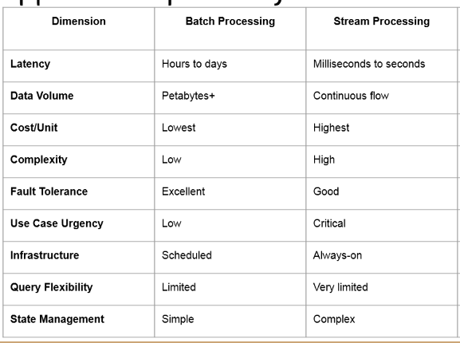
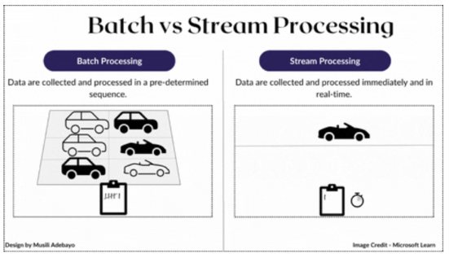

# Technical report - Jonas Gstöttenmayr

In this technical essay I will write about the synergy between different distributed data processing and analysis technologies and with AI/ML applications.

This will be done in four major parts:

1. [Analytical processing foundations](#1-analytical-processing-functions)
1. [Streaming, event processing and CDC](#2-streaming-event-processing-and-cdc)
1. [Implications for AI systems](#3-implications-for-ai-systems)
1. [Technical Positioning and Future Outlook](#4-technical-positioning-and-future-outlook)

## 1. Analytical Processing functions

To start out with I will explain the role of data warehouses (DWH) and analytical engines, before going into a more abstract deep dive into the analytical and transactional processing plane.

DWHs are usually used for OLAP because they store a truly massive amount of data, as well as a history of changes to said data. The data in DHWs comes from a variety of sources, like our very own OLTPs, before storing the data in the DWH we transform it, either when loading it through an ETL (extract transform load) or if we use kappa architecture and thus a stream processor. We can even store the raw data in the DWH in a different table from the processed one which would lead toa medallion structure.

The big difference from analytical (OLAP) and transactional processing (OLTP) are the use cases.

**OLTP** needs to be very accurate and quite fast for writing, following principles like ACID, a relevant technology would be Postgres. A OLTP DB is quite specialised for its purpose, for example we can have one for our orders one for our click counting, the accuracy here is important as we don't want to charge customers twice for an order.

**OLAP** on the other hand needs very fast read and aggregation performance as here we want to query ALL our different OLTPs information (not the actual DBs) and get actual information about different structures, OLAP are thus much more read oriented with optimisations I'll get to later. For example we wish to know our dialy profits and for them to update on our dashboard every day.

To sum up OLTP stores the raw data as it comes in, OLAP stores the merged and processed data from the OLTPs and allows us the query it ad-hoc, or automatically with heavy optimizations for regular queries.

To enable OLAPs to have amazing read performance there are quite a few technologies:

- *indexes* store a specialised version of the indexed column, allowing us to find data faster but taking up extra storage space.\
  The indexed column is optimized for a specific reading cases, like filtering for a specifc value in which case a a reverse index which stores all unique values of a column and in which columns they appear would be amazing \
  -> e.g. reverse-index: value "m" occurrences [1,50,20,5]\
  To reiterate using indexes allows us to filter rows at truly fast speeds and read even millions of records in milliseconds.
- *materialized views* are specific queries whose result we store on the disk, the result itself is a table we can query\
  Materialized views allow for IVM (incremental view maintenance), which updates the views every time a new record comes in rather than recalculating it from the whole dataset, saving a lot of processing power and time.\
  This is a way to precompute the result of expensive queries allowing us to simply read the updating results in a very short amount of time.\
  Of course materialized views take up quite a bit of storage space as well as computing resources to keep updated.
- *query optimization* also plays a heavy role in OLAP as often we need to run very specific queries quite often (20% of queries account for 80% of the workload)\
  As such the DB engineers need to take specific care on how to store the data, as well as which indexes and views to implement, there are some very specific indexes which can greatly increase performance, like star indexes which precompute aggregates.

---

## 2. Streaming and Event Processing, and CDC

Now that we have talked about the analytical plane, we actually need to get data into it, the lowest latency way is through stream processing while the more efficient but slower way is through batch processing.

The following table lists the most important differences between batch and stream processing:

\n
*Table by Adriano Vogel PhD*

As the extensive list shows there are quite a few differences the most important being that stream processing handles real time data through events, while batch processing handles enormous amount of data at once (usually in regular time intervals or when enough data has accumulated).

This difference leads to batch-processing being the cheaper and easier version, while streaming is quite a bit more expensive, especially with its frequent network traffic. Furthermore, streaming requires very specialised technologies and expertise to handle the complexity of the system.

A good real word comparison would be that batch is like a large parking lot where we wait for it to fill before processing the cars, while streaming is a road where cars drive along.

\
*Image from [medium](https://medium.com/art-of-data-engineering/understanding-batch-and-stream-processing-6b4f585b6dea)*

The overlap between streaming and incremental analysis (version of batch processing) is that they both avoid re-calculating the entire dataset and only calculate the difference between the last element/batch and the new one.

A big trade-off is that streaming absolutely trounces batch processing when it comes to latency as events are calculated when they come in we have (near) real time data processing while with batches we first have to wait to *fill* the batch before we even start the long processes of *processing* data en masse.

The cost for such quick processing, other than literal high network costs, is that it is quite hard to keep consistency. It needs to be able to guarantee that each message is only processed exactly once AND that each message is processed in the logical order (i.e. we first need to create an item order before we can cancel it). Batch processing does not need to deal with those problems (all one ordered batch, if it fails try again).

What both have to deal with, but mostly streaming is that messages can be late (executed early but only arrive 1h after being executed due to network outage) most streaming windows want near real-time and as such cannot afford a 1h watermark that would wait an hour for the late message, while most batch processes happen on a schedule which is not so unlikely to be a daily schedule where a 1h difference would be not very tragic (also from a psychological standpoint, there will be far less people ordering before midnight and as such less chance for a late message). Furthermore we can even run the batch process as few hours after midnight to ensure full message deliver as no manager will care if it finishes its analysis at one or three in the morning.

To sum up it is easier and most often better to simply use batch processing, unless (near) real-time data is needed/wanted/of benefit.

--- 

 

## 3. Implications for AI Systems

In this chaper I will explore as to how these technologies effect AI systems.

The hottest systems even now are still LLMs (or at least their extensions like Agentic).\
AI is *mostly* a data problem as such Data infrastructure is quite vital for it, but for most LLMs they require a lot of data when training and at which point it is a straight pipeline where the difficulty actually stems from the processing power needed to *train on* enormous amount of data, real time data is also not a very big concern here as we simply need to be able to load data quick enough for the LLM to see it before showing it the next batch of data.
As such pre-processing it or processing the data with minibatches (like with spark) is fine. Training itself already happens in batches for neural networks as such fetching the data in batches is actually uniquly fitting for training them.

Running a LLM requires no more data than a prompt. Delivering the prompt as soon as it is sent is of course of utmost importance, so for this streaming architecture would be optimal. So that the LLM can start calculating its answer as soon as possible and we can show the user in real time generation of the answer and how the LLM is rewriting it.

For RAGs (LLM which search through *provided* documents to answer questions) processing the documents before usage is the most important step, this step is not time critical and as such can be done in a big batch and when a new document arrieves. RAGs are usually used to answer questions about documentation and other company internal documents, which we do not add on a regular basis nor in a millisecond tact, so streaming will find no home here. To process the data we not only modify the documents (make them more LLM readable) but we can also keep a OLAP which stores a summary for each document and expand it even further with an index of which words are contained in which pages of which documents, allowing for a more efficient document search by simply matching the prompt words to words appearing in documents and then ranking the documents according to importance, such that better matching documents are read first.

While LLMs are quite interesting they are only a small part of the ML family and other models can actually benefit far more from a consistent dataflow, like the good old decision tree models, or rather their ensemble version, the random forest. Certain financial firms train a random forest every morning before the market opens to actively buy and sell stocks, these models generate million in revenue or losses, and their effectiveness is directly correlated to the speed/latency of their input data.

The query these models ask are always the same (what is the latest price, what is todays overall trend, what is the seasons trend...) and the answer to this query is required as fast as possible (within milliseconds). This system would require a RTOLAP (Real Time OLAP) which can calculate these queries with a speed optimized to the very brink of whats possible.\
To get the data from the markets to the RTOLAP would require a streaming layer like Kafka (for new data) and a streaming processor which is event driven (like Kafka streams) to update the metrics like trend... once calculated the data would be brought to the RTOLAP which would add other relevant data (e.g. how the trend was like on this exact day one year ago). To get the Data into kafka we would want a CDC (change data capture) which adds a new message to the topic the instance a change in the monitored System (in this case the market price API) appears .

---

 

## 4. Technical Positioning and Future Outlook

To end this essay, I will give my opinion on some interesting questions about the future.

**Will AI workloads push data systems toward unified architectures, or deeper specialization?, Which components become more central (streaming, incremental views, serving layers)?**

For the future of neural network trainng at least I believe that it will drive architectures to adapt through a merging of streaming and batching. Currently the biggest problem for neural networks is the training speed, while the lack of data is also important the sheer time it takes to train certain models is the real bottleneck, as the training speed increases I believe that data architecture will gain more relevance in this field, especially whith having to transfer the truly large amount of data required by these systems to them in a fast enough time to not slow down training (after future optimizations).

To enable this a new mixed architecture would need to emerge which focuses on the same part as neural network training - *minibatches*. A version of a stream processor where each event is not a single data point but instead a minibatch, stored in a compressed vector so that a single CPU instruction can move it. This would save CPU power on not just the training system but also the data processing systems. Having a minibatch based streaming allow the neural network to directly receive the samples in an already consumable manner. As such a mixture of streaming and batchig will be most central for NNs in my opinion, while views and serving layers will be mostly used in other areas than neural networks (quite likely also ML system like in my decision tree example above), but this goes beyond the scope of what I wish to answer here.

**What architectural principles are expected to matter most in the next 5–10 years?**

Overall, I believe streaming to matter most over next years as the technology continues to evolve and improve, ironing out its flaws and improving upon its strengh. Especially with some Batch processing mixed in and most excitingly in the context of vectors to allow for modifying entire vectors (collection of samples) with single CPU instruction, yielding massive performance improvements.

---

Sources: Lecture Notes by Adriano Vogel PhD
